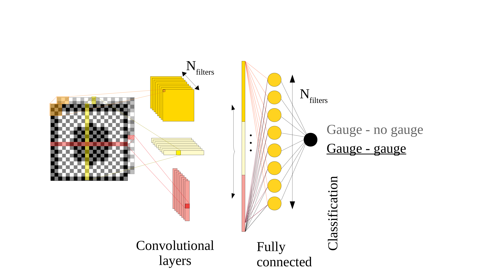
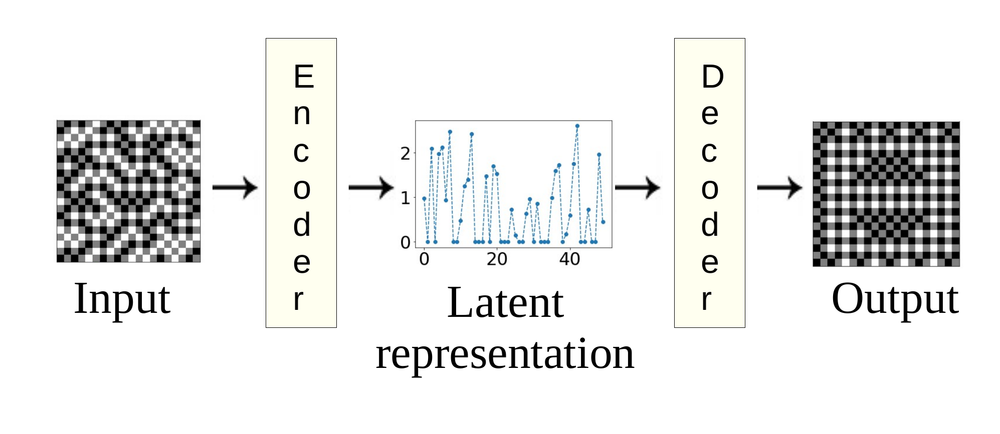

# Code of the article "Learning the gauge symmetry using Machine Learning"

this repository contains the code for both tasks described in the following [article](https://arxiv.org/abs/1904.07637).

## Classifying Gauge orbits

we describe an example of a deep neural network designed for classifying pairs of Ising system $J$ and $J'$ into being in the same gauge orbit or not. In the jupyter-notebook **DCNN_simple.ipynb**, all the details are commented.

    
## AutoEncoder

We show in the jupyter-notebook **AutoEncoder.ipynb**, how deep-convolutional neural network can be use to find a latent representation of the gauge orbits of a 2D Ising model with discret $J_{ij} \pm 1$ interactions.
All steps are details using the keras library for a system size $L=5$. In addition, it is shown how the latent representation can be used for classfication.

